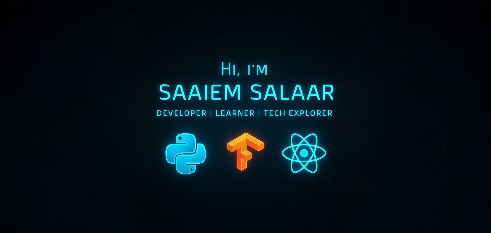

  

## Hey, my name is SAAIEM SALAAR 

 
   
  

I’m Computer Science student, a developer who enjoys learning new skills and technologies. I have experience in Machine Learning, Blockchain and Web Devlopment. You can find my projects in [repositories](https://github.com/Salaar-Saaiem?tab=repositories).

  
  &nbsp; &nbsp; &nbsp; &nbsp;
  

---

### 💻 Tech Stack

#### 🚀 Languages
  
  
  
  
  
  
  
  
  

#### 🧠 Libraries & Frameworks
  
  
  
  
  
  
  
  
  
  
  
  
  

#### 🛢️ Databases & Tools

---

### 🎯 Interests
> 👍 AI & Deep Learning  
> 👍 Full Stack Web Development  
> 👍 App Development  
> 👍 Machine Learning  

---

### 📌 Featured Projects

### 📊 GitHub Stats

  

  
  

---

### 📬 Connect with Me

  
  &nbsp;&nbsp;
  
  &nbsp;&nbsp;
  
  &nbsp;&nbsp;
  

